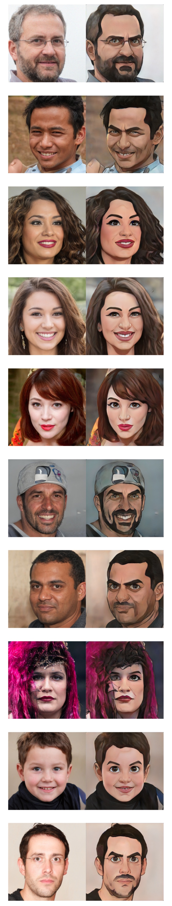

# ToonClip-ComicsHero MobileUNet++ Style Transfer Model
Style Transfer a face into cartoon without a GAN discriminator.  A UNet++ network with MobileNet v3 backbone optimized for mobile frameworks trained with VGG Perceptual Feature Loss trained with PyTorch Lighting.

Most of the code snippets are available on this blog post: https://medium.com/@JMangia/optimize-a-face-to-cartoon-style-transfer-model-trained-quickly-on-small-style-dataset-and-50594126e792

Full source code and a end to end notebook will be released soon.

## Credits and Data

This model has been strongly inspired by the work of Doron Adler reusing also his data available on this github repo: https://github.com/Norod/U-2-Net-StyleTransfer

For the Weighted VGG Perceptual Loss function I also wanted to credit the Fast.AI Mooc from Jeremy Howards and this snippet made available by Alper Ahmetoğlu at https://gist.github.com/alper111/8233cdb0414b4cb5853f2f730ab95a49

## iOS App

This is the model used by the **ToonClip** iOS App available on Apple App Store at https://apps.apple.com/us/app/toonclip/id1536285338

**ToonClip** app use this model for picture and live video style transfer.

https://user-images.githubusercontent.com/8699190/148970633-c9684fca-9aee-4de7-a204-ad09b7caae9e.mp4

## HuggingFace Spaces Demo

https://huggingface.co/spaces/Jacopo/ToonClip

## HuggingFace ONNX Model

https://huggingface.co/Jacopo/ToonClip

## Example images from untrained FFHQ validation set:

